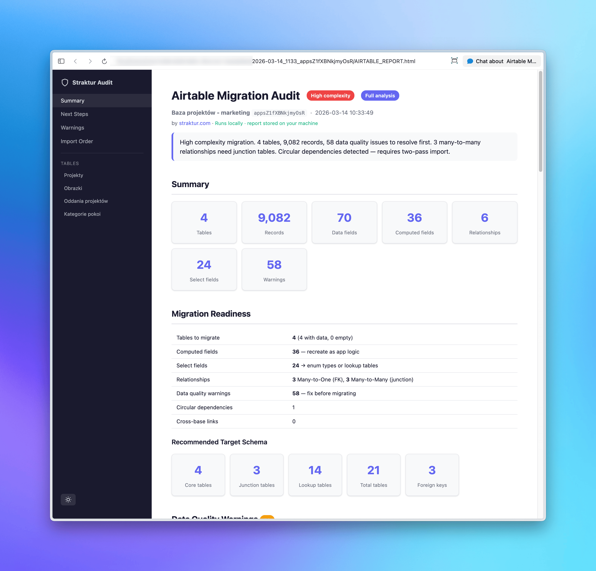

# Airtable Migration Audit by [straktur.com](https://straktur.com?utm_source=airtable-migration-audit&utm_medium=github&utm_content=readme-header)

Outgrowing Airtable? This tool tells you exactly what it takes to migrate. Point it at your bases and get a migration-readiness report: complexity verdict, schema recommendations, data quality blockers, and a concrete action plan.

Works as a **CLI tool** or as a **Claude Code skill** (`/airtable-migration-audit`) that reads the report and delivers a structured verdict.



> [!IMPORTANT]
> **Runs locally.** Your Airtable data is fetched directly to your machine using your read-only token, analyzed locally, and written to local report files. Nothing is sent to a Straktur backend or any third-party service. You decide if and with whom you share the results.

## Prerequisites

- **Node.js 18+** (uses native `fetch`)
- **npm**

## What it audits

- **Schema structure** — tables, fields, types, relationships, dependency graph, import order
- **Data quality** — null rates, value distributions, constant fields, composite values, similar choices (typo detection)
- **Migration complexity** — Many-to-One vs Many-to-Many relationships, circular dependencies, cross-base links
- **Recommendations** — target PostgreSQL schema, dictionary candidates, computed fields to recreate, attachment migration plan

## Quick Start

```bash
# 1. Install dependencies
npm install

# 2. Configure
cp .env.example .env
# Edit .env — set AIRTABLE_API_KEY (required)
# Optionally set AIRTABLE_BASE_IDS, or let the tool auto-discover your bases

# 3. Run (choose one)
npm run discover:schema    # Fast — schema only (seconds)
npm run discover           # Full — schema + all records (minutes)

# 4. Read the report (in data/<date>_<baseIds>/ subfolder)
cat data/*/AIRTABLE_REPORT.md
```

## Two Modes

| Mode | Command | Time | Data fetched | Best for |
|------|---------|------|--------------|----------|
| **Schema only** | `npm run discover:schema` | Seconds | Table structure, fields, relationships | Initial overview, understanding structure |
| **Full analysis** | `npm run discover` | Minutes | Schema + all records | Pre-migration analysis, data quality audit |

### Schema-only report includes:
- Table and field inventory
- Field types and configurations
- Select field choices
- Linked record relationships
- Dependency graph / import order
- Cross-base link detection

### Full report adds:
- Per-field null rates and value distributions
- Text field length statistics
- Numeric field ranges (min/max/avg/median)
- Relationship cardinality analysis (Many-to-One vs Many-to-Many from actual data)
- Dictionary candidate detection (fields with few unique values)
- Data quality flags (long text, unused choices, high nullity)

## Claude Code Skill

This project includes a [Claude Code](https://docs.anthropic.com/en/docs/claude-code) skill. Run `/airtable-migration-audit` and the agent will:

1. Run the audit (or use an existing report)
2. Read the generated report
3. Deliver a structured verdict: complexity verdict, blockers, schema recommendation, and next steps

The skill is at `.claude/skills/airtable-migration-audit/SKILL.md`.

## Environment Variables

| Variable | Required | Description |
|----------|----------|-------------|
| `AIRTABLE_API_KEY` | Yes | Personal Access Token (`pat...`). [Create one here](https://airtable.com/create/tokens). Scopes: `schema.bases:read` (schema-only), add `data.records:read` (full) |
| `AIRTABLE_BASE_IDS` | No | Comma-separated base IDs (`appXXX,appYYY`). If omitted, the tool lists all bases available for the token and prompts you to choose. |
| `AIRTABLE_USE_FIELD_IDS` | No | Set to `false` to use field names instead of IDs as record keys. Default: `true` |

## Output

Each run creates a timestamped subfolder under `data/`:

```
data/
  2025-01-15_0930_appXXX_appYYY/
    AIRTABLE_REPORT.md     # Markdown report (for agents / CLI)
    AIRTABLE_REPORT.html   # Interactive HTML report (open in browser)
    raw-schema.json        # Raw Airtable schema
  2025-01-15_1415_appXXX_appYYY/
    ...
```

Each run includes a timestamp (HHMM) so previous reports are never overwritten. The HTML report is a single self-contained file with dark/light mode, collapsible sections, and sidebar navigation — no external dependencies.

## Project Structure

```
airtable-migration-audit/
├── src/
│   ├── discover.ts                  # Main script (--schema-only flag)
│   └── lib/
│       ├── airtable-client.ts       # API client: schema + record fetching
│       ├── data-analyzer.ts         # Per-field statistics (full mode)
│       ├── schema-report-generator.ts  # Schema-only report
│       ├── report-generator.ts      # Full analysis report
│       └── mapping.ts              # AT record ID ↔ target ID persistence
├── data/                           # Generated output (gitignored)
├── .claude/skills/                 # Claude Code skill definition
├── package.json
└── tsconfig.json
```

## Design

- **Zero external dependencies** in library code — only Node built-ins (`fs`, `path`) and native `fetch`
- Only `dotenv` and `tsx` as project dependencies
- Pure functions for analysis and report generation
- Standalone — no framework dependencies
